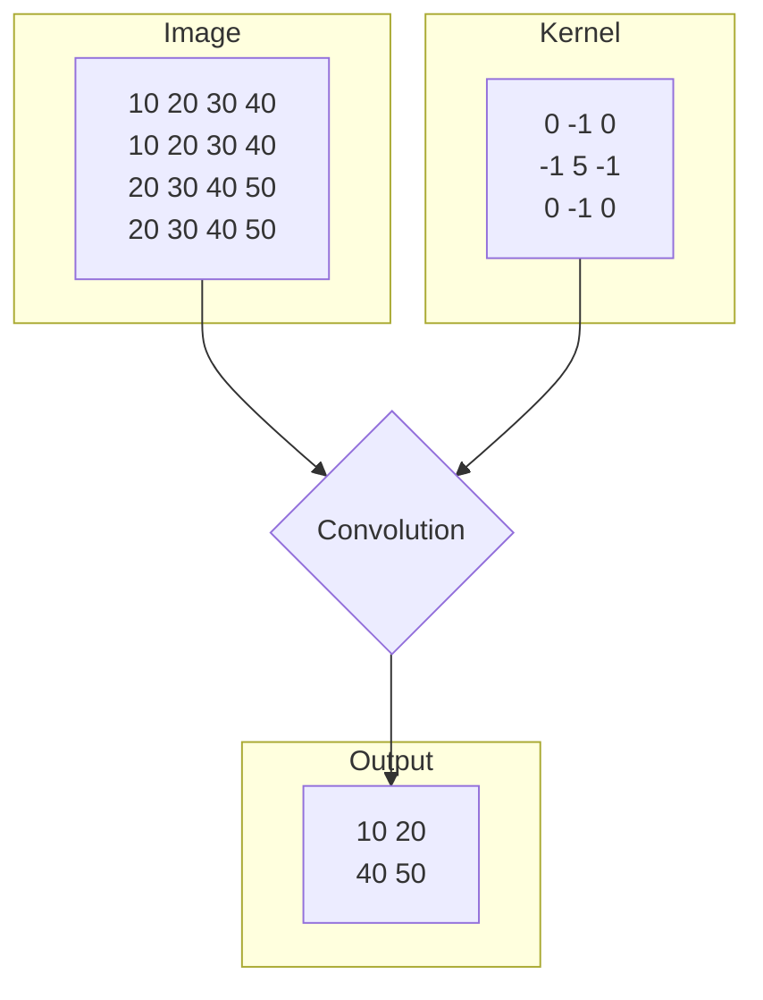
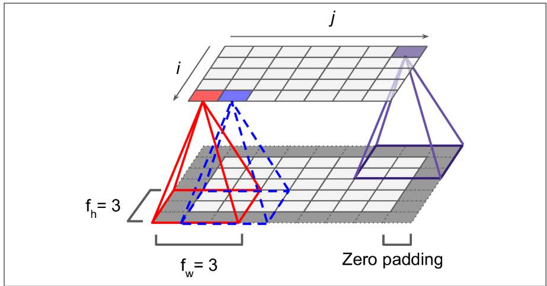
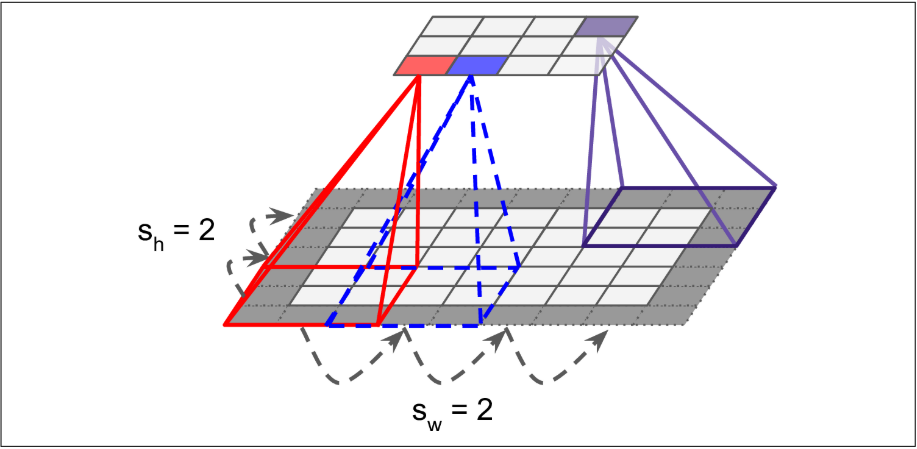
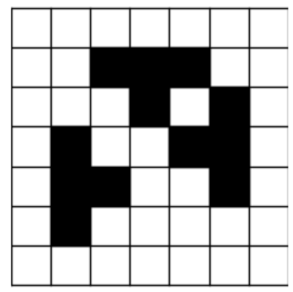
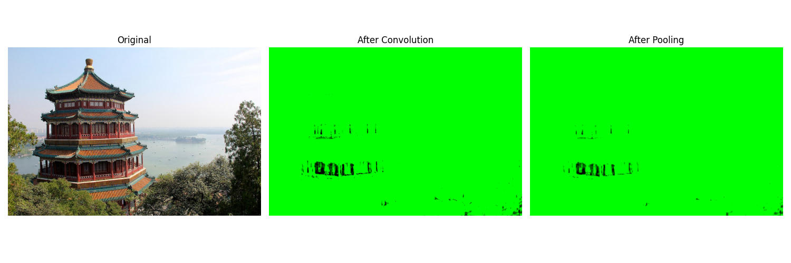
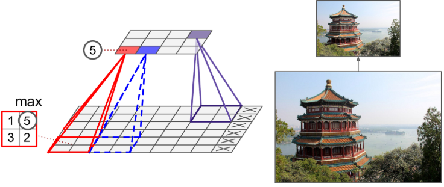
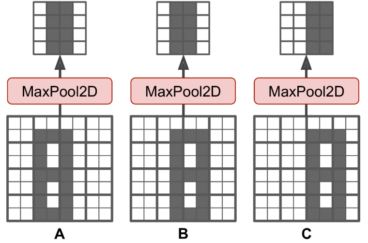
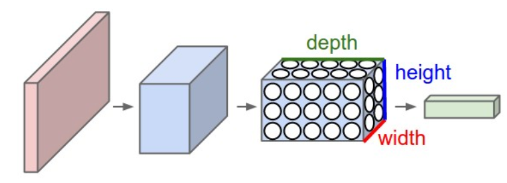

# Image Convolution 👨🏽

In this project, we will create two small programs to compare different Image filters and Pooling methods.

Image convolution is a image filtering technique. 

# Convolution Layers

## Convolution operation 🥨

Suppose we have N x N matrices A and B. We define $A \circ B$ as follows, where $\circ$ is the convolutional operator. 

$$(A\circ B)_{i,j} =A_{i,j} B_{i,j}$$

The activation of a filter on an image of the same size is found by applying the convolutional operator to the filter and the image, then taking the sum of the entries in the resulting matrix, adding the filter's bias, and applying an activation function to it. 

Example:



Neurons in first convolutional layer are not connected to every single pixel in the input image 📸, but only to pixels in their **receptive fields**. This architecture allows the network to concentrate on small low-level features in the first hidden layer, then assemble them into larger higher-level features in the next hidden layer, and so on



*Fig: Applying convolution with zero padding*

$(i, j)$ neuron of a given layer is connected to $(i, i+f_h-1) * (j, j+f_w-1)$ neurons of previous layer.

where, $f_h, f_w$ are height and width of filter

Size of the resultant feature map = $(H - f_h + 1)*(W - f_w + 1)$

where,

$H, W$ are height and width of image

### Filters 🎞️

The most commonly used kernel in image convolution is the Gaussian kernel, which is used to smooth images and reduce noise. Other kernels are used for different purposes, such as edge detection or feature extraction.

#### Gaussian Kernel 🧈

**Gaussian kernel** is a kernel used in image processing to smooth images and reduce noise. It is a matrix of weights or coefficients, with the center weight being the highest and the weights decreasing as we move away from the center. 

The weights are calculated using a Gaussian distribution, which is a bell curve that assigns higher weights to the pixels closer to the center and lower weights to the pixels farther away from the center. 

An example of a 3x3 Gaussian kernel is:

| 1 | 2 | 1 |
| --- | --- | --- |
| 2 | 4 | 2 |
| 1 | 2 | 1 |

This kernel can be normalized by dividing each element by the sum of all the elements in the kernel, which is 16 in this case.

## Striding (to walk) 🚶🏽‍➡️


It is also possible to connect a large input layer to a much smaller layer by spacing out the receptive fields. The shift from one receptive field to the next is called the stride.

$(i, j)$ neuron is connected to $(i\star s_h, i\star s_h + f_h - 1) * (j\star s_w, j\star s_w + f_w - 1)$

$s_h, s_w$ are vertical and horizontal strides.




*Fig: Reducing dimensionality using a stride of 2*

Size of resultant feature map = $(\frac {W - f_w}{S_w} + 1) * (\frac {H - f_h}{S_h} + 1)$

## Padding 🏓

We pad the image on sides so that we can catch partial objects and **avoid shrinking the width and height** of the input as it passes through convolutional layers.



*Fig: applied p=1 on "+" sign*

Dimensions of feature map or number of positions, after applying filter with padding P: 

$(\frac {W - f_w + 2P}{S_w} + 1) * (\frac {H - f_h + 2P}{S_h} + 1)$

```python
# This will set filters as trainable variables
conv = keras.layers.Conv2D(filter=32, kernel_size=3, strides=1,padding="same", activation="relu")

# Provide custom filters
gaussian_blur = np.array([[1, 2, 1],
                          [2, 4, 2],
                          [1, 2, 1]]) / 16.0
conv_gaussian = Conv2D(filters=1, kernel_size=3, padding='same', use_bias=False, kernel_initializer=tf.keras.initializers.Constant(gaussian_blur))

# Padding:
# same: the convolutional layers uses zero padding if necessary
# valid: the convolutional layers may ignore some rows and columns at the bottom and right of the input image.
```



*Fig: Convolution (sharpen filter used) and pooling result*

# Pooling Layers 🎱

**Pooling** is a technique used in computer vision and image processing to down sample an image or feature map by applying a function, such as max or average pooling, to non-overlapping blocks of the input (Using striding).

Pooling helps to reduce the spatial dimensions of the input, which can reduce the computational requirements of subsequent layers in the network and help to prevent overfitting.

Pooling is commonly used in convolutional neural networks (CNNs) for image classification and other computer vision tasks.



*Fig: Max pooling layer (2 × 2 pooling kernel, stride 2, no padding)*

**Example →** Suppose that kernel size is $3x3$, and our stride is $S=2$.  If we have a $45×25$ input image, what will be the number of datapoints in the down sampled image after applying this pooling operation?

**Solution →** Using our formula, we will have 
$(\frac{45−3}{2}+1)(\frac{25−3}{2}+1)=264$ samples from the image. 
3x3 block replaced with 1x1 block. So total, 264 data points.
If we consider depth of pixel (3) ⇒ 3 layer will have = 3 x 264 = 792 datapoints

## Types of Pooling layers 🥪

Most commonly used pooling layers are max and average pooling as explained below.

### 1. Max Pooling Ⓜ️

**Max pooling** is a pooling operation that outputs the maximum value within each non-overlapping block of the input.

Max pooling helps to reduce the spatial dimensions of the input and can help to prevent overfitting by reducing the number of parameters in the model.

Max pooling is generally used over average pooling since it has performed better in experiments.

Example →

)](images/image-5.png)

*Fig: Max pooling (Source: [Papers with code](https://paperswithcode.com/method/max-pooling))*

A max pooling layer also introduces some level of invariance to small translations. But in some applications invariance is not desirable like semantic segmentation.



*Fig: Invariance to small translations*

```python
max_pool = keras.layers.MaxPool2D(pool_size=2)
```

Max pooling performs better than average pooling because:

- max pooling preserves only the strongest features, getting rid of all the meaningless ones
- offers stronger translation invariance
- Requires less compute

### 2. Average Pooling 🅰️

**Average pooling** is a pooling operation that outputs the average value within each non-overlapping block of the input.

Average pooling helps to reduce the spatial dimensions of the input and can help to prevent overfitting by reducing the number of parameters in the model.

Example →

)](images/image-7.png)

*Fig: Average Pooling (Source: [Papers with code](https://paperswithcode.com/method/average-pooling))*

Global average pooling layer: It compute the mean of each entire feature map.

```python
global_avg_pool = keras.layers.GlobalAvgPool2D()
```

# Using multiple convolutional step 🪜



*Fig: Feature matrix at first step*

When actually creating a CNN, we will want to have multiple filters to recognize different features at each convolutional step.

This means that our output matrix has a **volume**: if we have K $N × N$ filters and apply them to a $W × H$ image with P padding and S stride length, our output matrix will have dimensions $(\frac{W−N+2P}{S}+1)×(\frac{H−N+2P}{S}+1)×K$.

So, if we want to use another convolution on the matrix with depth K above, we will need to use filters that also have depth K.

Here, number of trainable parameters = $f_h * f_w  + k$. Each filter has its own bias also.

## Troubleshooting 🌠

### Installed Tensorflow but Cuda is not set

```
2024-10-20 12:35:17.323136: I tensorflow/core/util/port.cc:153] oneDNN custom operations are on. You may see slightly different numerical results due to floating-point round-off errors from different computation orders. To turn them off, set the environment variable `TF_ENABLE_ONEDNN_OPTS=0`.
2024-10-20 12:35:17.354318: I external/local_xla/xla/tsl/cuda/cudart_stub.cc:32] Could not find cuda drivers on your machine, GPU will not be used.
2024-10-20 12:35:17.591468: I external/local_xla/xla/tsl/cuda/cudart_stub.cc:32] Could not find cuda drivers on your machine, GPU will not be used.
2024-10-20 12:35:17.888093: E external/local_xla/xla/stream_executor/cuda/cuda_fft.cc:485] Unable to register cuFFT factory: Attempting to register factory for plugin cuFFT when one has already been registered
2024-10-20 12:35:18.125883: E external/local_xla/xla/stream_executor/cuda/cuda_dnn.cc:8454] Unable to register cuDNN factory: Attempting to register factory for plugin cuDNN when one has already been registered
2024-10-20 12:35:18.190703: E external/local_xla/xla/stream_executor/cuda/cuda_blas.cc:1452] Unable to register cuBLAS factory: Attempting to register factory for plugin cuBLAS when one has already been registered
2024-10-20 12:35:18.570909: I tensorflow/core/platform/cpu_feature_guard.cc:210] This TensorFlow binary is optimized to use available CPU instructions in performance-critical operations.
To enable the following instructions: AVX2 AVX_VNNI FMA, in other operations, rebuild TensorFlow with the appropriate compiler flags.
2024-10-20 12:35:21.157449: W tensorflow/compiler/tf2tensorrt/utils/py_utils.cc:38] TF-TRT Warning: Could not find TensorRT
```

Disable the warnings using following commands:
```
export TF_ENABLE_ONEDNN_OPTS=0
export TF_CPP_MIN_LOG_LEVEL=2

import os
os.environ['TF_CPP_MIN_LOG_LEVEL'] = '2'
```

To again enable the warnings use following commands:
```
unset TF_ENABLE_ONEDNN_OPTS
export TF_CPP_MIN_LOG_LEVEL=0

import os
os.environ['TF_CPP_MIN_LOG_LEVEL'] = '0'
```

## References

1. Hands-On Machine Learning with Scikit-Learn, Keras, and TensorFlow [Buy here](https://www.oreilly.com/library/view/hands-on-machine-learning/9781098125967/)
2. Brilliant.org