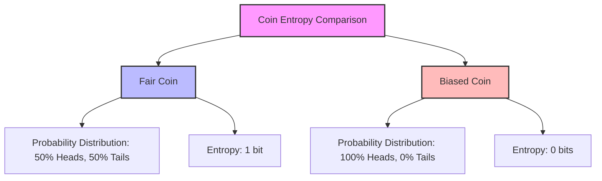

# Information Theory

Information Theory, pioneered by Claude Shannon, is a field that studies the quantification, storage, and communication of information. Let's explore some fundamental concepts:

## Information Content 💰

The **amount of information** (number of bits information) provided by an event is inversely related to its probability. We quantify this as:

$I(x) = -\log_2(p(x))$

Where $p(x)$ is the probability of the event.

Key points:
- Rare events provide more information
- Common events provide less information

**Example:** Weather forcast 🌡️ predicts that today it will be sunny with 75% and rainy with 25%. Then the amount of information provided by each event is following:

Sunny event ☀️, $-log_2(0.75) = 0.41$ bits

Rainy event 🌧️, $-log_2(0.25) = 2$ bits

In Shannon’s theory, to transmit one bit of information means to reduce the recipients uncertainty by a factor of 2.

## Entropy: Quantifying Uncertainty 😊

Entropy is a measure of the uncertainty or randomness in a set of probabilities. It represents the **average amount of information** obtained from one sample of a probability distribution.

Mathematically, entropy is defined as:

$H(X) = -\sum_{x \in X} p(x) \log_2 p(x)$

Where $p(x)$ is the probability of each possible outcome.

Interpretation:
- High entropy indicates high uncertainty (e.g., a fair die roll)
- Low entropy indicates low uncertainty (e.g., a biased die)



Example: For our weather forecast, the average amount of information transferred is as following:

Weather forecast 🌡️, 75% * 0.41 + 25% * 2 = 0.81 bits

## Cross-Entropy: Evaluating Predictions ⚖️

Cross-entropy measures how well a predicted probability distribution matches the true distribution. It's calculated as:

$H(p,q) = -\sum_{x} p(x) \log_2(q(x))$

Where $p(x)$ is the true probability and $q(x)$ is the predicted probability.

The values are used to determine the loss of your model's predictions. 

**Key point:** Cross-entropy is always greater than or equal to the true entropy. As predictions improve, cross-entropy approaches the true entropy.

## Kullback-Leibler Divergence (KL-Divergence) 💸

KL-Divergence quantifies the difference between the predicted distribution and the true distribution. It represents the **"cost"** of using predictions instead of true probabilities.

$D_{KL}(p||q) = H(p,q) - H(p)$

Where $H(p,q)$ is the cross-entropy and $H(p)$ is the true entropy.

These concepts are used in machine learning, to measure the loss of your probability distribute. We often use cross-enctropy and KL divergence loss in different machine learning applications.

# Calculator

I created a small program to calculate entropy, cross-entropy loss and KL divergence loss given the true and predicted probability distribution.

```bash
(.venv) $ python calculator.py 
Enter the true distribution (space-separated probabilities): 0.6 0.4
Enter the predicted distribution (space-separated probabilities): 0.7 0.3
Entropy of P: 0.9710
Cross-enctropy of P and Q: 1.0035
KL-divergence of P and Q: 0.0326
```