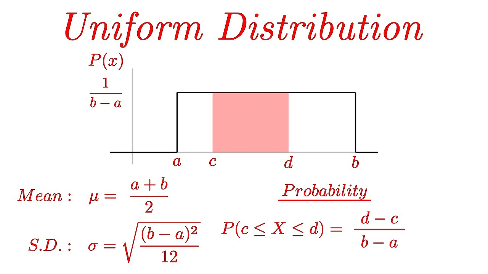
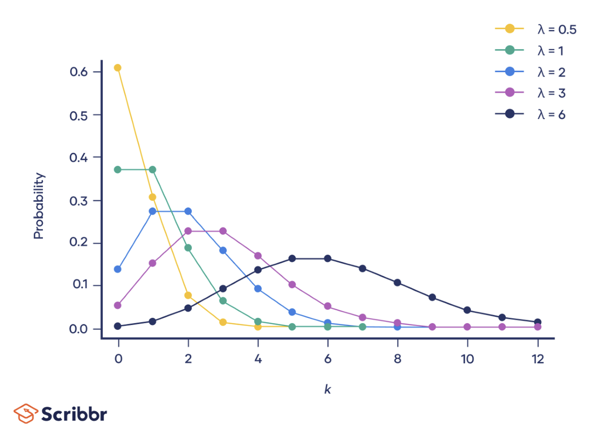
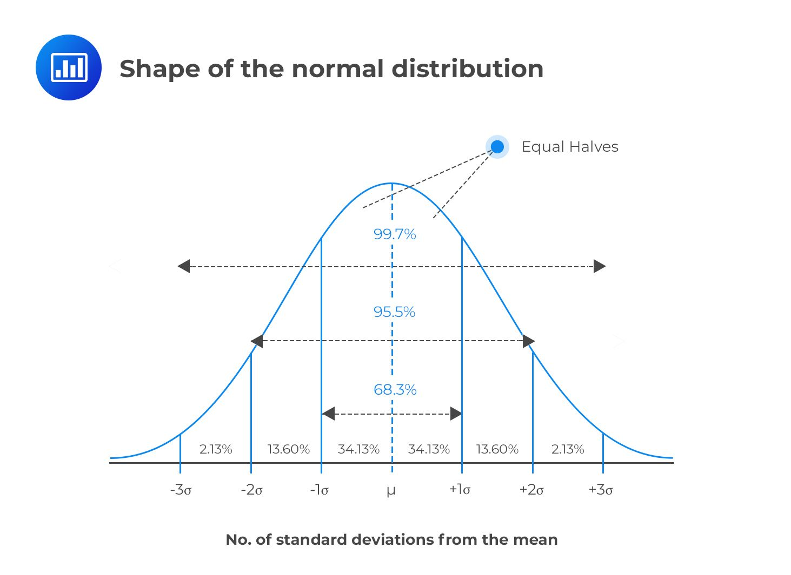

# Probabilistic theory 🔨

In this section we will learn about concepts related to likelihood of events i.e. Probability.

# Operation on Probabilities ⭕

### Basic Probability Operations 😵‍💫

For two events A and B, we have these fundamental operations:

| Operation | Formula | 
| --- | --- |
| Union | $P(A \cup B) = P(A) + P(B) - P(A \cap B)$ |
| Intersection | Dependent events $P(A \cap B) = P(A \lvert B) \cdot P(B)$  |
| | Independent events $P(A \cap B) = P(A) \cdot P(B)$ | 
| Complement (NOT) | $P(A') = 1 - P(A)$ |

These operations form the foundation for more complex probability calculations and are essential for solving real-world probability problems.

# Probabilistic Independence 🎌

## Independent Events 👆

Elementary

- Two events A and B are independent iff, $P(\text{A and B}) = P(A) . P(B)$
- If events A and B are dependent, then $P(\text{A and B}) = P(A|B) . P(B)$

## Probability of a series of n Independent Events 🌃

For a series of n independent events, the probability of all events occurring is the product of their individual probabilities:

$P(A_1 \cap A_2 \cap ... \cap A_n) = P(A_1) \cdot P(A_2) \cdot ... \cdot P(A_n)$

This is because independence means that each event's probability is not affected by the others.

For example:

- The probability of getting heads three times in a row when flipping a fair coin: $\frac{1}{2} \cdot \frac{1}{2} \cdot \frac{1}{2} = \frac{1}{8}$
- The probability of rolling a six three times in a row with a fair die: $\frac{1}{6} \cdot \frac{1}{6} \cdot \frac{1}{6} = \frac{1}{216}$

# Conditional Probabilities 🫙

Conditional probability is a measure of the probability of an event occurring, given that another event has already occurred. 

The formula for conditional probability is:

$P(A | B) = \frac{P(A ∩ B)} {P(B)}$

Where:

- P(A | B) is the conditional probability of A given B,
- P(A ∩ B) is the probability of both A and B happening,
- P(B) is the probability of B happening.

## Conditional probabilities using Bayes rule 📏

Bayes' theorem is a fundamental concept in the field of probability and statistics that describes how to update the probability of a hypothesis based on evidence. 

Another way to understand Bayes' theorem is that it provides a way to revise existing predictions or theories (posterior probabilities) given new or additional evidence. It is a principle in probability theory and statistics that allows you to update your prior beliefs, given new data.

The formula for Bayes' theorem is:

$P(A | B) = \frac{P(B | A) * P(A)} {P(B)}$

Where:

- P(A | B) is the conditional probability of A given B,
- P(B | A) is the conditional probability of B given A,
- P(A) and P(B) are the probabilities of A and B respectively.

**E.g.** Bag I contains 4 white and 6 black balls while Bag II contains 4 white and 3 black balls. One ball is drawn at random from one of the bags (with 50% probability for each bag) and it is found to be black. Find the probability that it was drawn from Bag I ❓

**Solution: ⭐**

- $B_1$ event of choosing bag 1
- $B_2$ event of choosing bag 2
- $A$ event of drawing a black ball
- $P(A|B_1) = 6/10 = 0.6$
- $P(A|B_2) = 3/7 = 0.429$
- $P(B_1) = P(B_2) = 0.5$

We know that:

**Using conditional probability:**
$$
P(B_1|A) = \frac{P(A\cap B_1)}{P(A) }
$$

**Using Bayes Theorem:**
$$
P(B_1|A) = \frac{P(A|B_1) \cdot P(B_1)}{P(A)}
$$

Using **total probability** we can find the $P(A)$:

$P(A) = P(A|B_1) \cdot P(B_1) + P(A|B_2) \cdot P(B_2)$

$P(A) = 0.6 \times 0.5 + 0.429 \times 0.5 = 0.3 + 0.2145 = 0.5145$

Substituting the values in Bayes theorem formula, we get:

$$
P(B_1|A) = \frac{0.6 \times 0.5}{0.5145} = \frac{0.3}{0.5145} \approx 0.583
$$

Therefore, the probability that the black ball was drawn from Bag I is approximately 0.583 or 58.3%.

## Total Probability 😲

The law of total probability is a fundamental rule that allows us to calculate the probability of an event by considering all the different ways it can occur. It breaks down the probability into mutually exclusive scenarios.

The formula for the law of total probability states:

$P(A) = \sum_{i=1}^n P(A|B_i)P(B_i)$

Where:

- The B₁, B₂, ..., Bₙ are mutually exclusive and exhaustive events

<details>
<summary>Example of using Total probability ❓</summary>
A text classification algorithm classifies articles into the following categories: academic, persuasive, and informal. Consider the findings of the algorithm:

- There is a 60% chance that an article is classified as academic and 30% chance that it is classified as persuasive.
- If the article is classified as academic, there is 80% chance that it is scientific.
- If the article is classified as informal, there is 80% chance that it is not scientific.
- Half of the articles classified as persuasive are scientific.

If an article is randomly selected, what is the probability that the article is scientific?

**Solution ->** 

- P(A) = 0.60
- P(P) = 0.30
- P(I) = 0.10 (since probabilities must sum to 1)
- P(S|A) = 0.80
- P(not S|I) = 0.80, so P(S|I) = 0.20
- P(S|P) = 0.50

**Using the law of total probability:**

P(scientific) = P(scientific|academic) × P(academic) + P(scientific|persuasive) × P(persuasive) + P(scientific|informal) × P(informal)

$P(S) = (0.80 × 0.60) + (0.50 × 0.30) + (0.20 × 0.10)
= 0.48 + 0.15 + 0.02
= 0.65$
</details>

# Probability density function (PDF) 🦷

A PDF (Probability Density Function) is a mathematical function that:

- Describes the relative likelihood of a continuous random variable taking on a specific value
- Must be non-negative for all input values
- Must have a total area under the curve equal to 1

For a continuous random variable X, the PDF f(x) has these properties:

$f(x) \geq 0 \text{ for all } x$

$\int_{-\infty}^{\infty} f(x)dx = 1$

The probability that X takes a value in the interval [a,b] is given by:

$P(a \leq X \leq b) = \int_a^b f(x)dx$

Unlike discrete probability distributions which use PMF (Probability Mass Function), PDF is used for continuous random variables where the probability of any exact value is 0, and we must work with intervals.

In graphs, probability of a range can be the area under the curve.

E.g. - area of a triangle.

## Calculating Probability, Mean, and Variance using PDF 🧮

| Measure | Formula | 
| --- | --- |
| Probability | $P(c \leq X \leq d) = \int_c^d f(x)dx$ |
| Mean (expected value) | $\mu = E(X) = \int_{-\infty}^{\infty} xf(x)dx$ |
| Variance | $\sigma^2 = E[(X-\mu)^2] = \int_{-\infty}^{\infty} (x-\mu)^2f(x)dx$ |

Note → Integrate together.

Example:

For a uniform distribution on interval [a, b], the PDF is:

$$f(x) = \begin{cases} \frac{1}{b-a}, & a \leq x \leq b \\ 
0, & \text{otherwise} \end{cases}$$

In our case, a = 0 and b = 4, so:

$$f(x) = \begin{cases} \frac{1}{4}, & 0 \leq x \leq 4 \\ 
0, & \text{otherwise} \end{cases}$$

Solution:

$P(1 \leq X \leq 2) = \int_1^2 \frac{1}{4}dx = \frac{1}{4}[x]_1^2 = \frac{1}{4}(2-1) = 0.25$

$\mu = \int_0^4 x\cdot\frac{1}{4}dx = \frac{1}{4}[\frac{x^2}{2}]_0^4 = \frac{16-0}{8} = 2$

$\sigma^2 = \int_0^4 (x-2)^2\cdot\frac{1}{4}dx = \frac{16}{12} \approx 1.33$


- **Example 2️⃣**

    $$f(x) = \begin{cases} \frac{x^3}{4}, & 0 \leq x \leq 2 \\ 
    0, & \text{otherwise} \end{cases}$$
        
    what is the mean value of **X**?

    **Solution ✅**

    $\mu = E(X) = \int_{-\infty}^{\infty} xf(x)dx$

    $E(X) = \int_{0}^{2} xf(x)dx$

    $E(X) = \int_{0}^{2} x \frac{x^3}4dx$ ⇒ $E(X) = \int_{0}^{2} \frac{x^4}4dx$

    $E(X) = \frac{1}{4.5}[x^5]_0^2 = \frac{32-0}{20} = 1.6$


- **Example 3️⃣ (find mean, variance) ❓**

    X has following density function:

    $$f(x) = \begin{cases} 2x, & 0 \leq x \leq 1 \\ 
    0, & \text{otherwise} \end{cases}$$

    Find mean and variance?
    
    **Solution ✅**
    
    $\mu = E(X) = \int_{-\infty}^{\infty} xf(x)dx$

    $\mu = \int_{0}^{1}x f(x) dx = \int_{0}^{1} x * 2x dx = \int_{0}^{1} 2x^2 dx = \frac{2}{3} [x^3]_0^1 = \frac{2}{3}$

    variance

    $\sigma^2 = E[(X-\mu)^2] = \int_{-\infty}^{\infty} (x-\mu)^2f(x)dx$

    $\sigma^2 = \int_{0}^{1} (x-2/3)^2 2xdx = \int_0^1 (x^2 + 4/9 - 4x/3) 2x dx = \int_0^1 2x^3 + \frac{8x}{9} - \frac{8x^2}{3}dx = \frac{2}{4}[x^4]_0^1 + \frac{8}{9}[x^2]_0^1 - \frac{4}{3}[x^3]_0^1 = 2/4 + 8/18 - 8/9 = \frac{18+16-32}{36} = \frac{1}{18}$

<details>
<summary>Example 4 (find constant and probability)</summary>
Let X be a continuous random variable with PDF given by:
    
$$f(x) = \begin{cases} cx^2, & |x|<2 \\ 
0, & \text{otherwise} \end{cases}$$

find c and probability(x≥1)?

Solution:

We know the the area under PDF is 1. That means total probability sum is equals to 1.

$P = \int_{-2}^2cx^2dx = 1$

$\frac{c}{3} [x^3]_{-2}^2 = 1 => \frac{c}{3} [8+8] = 1 => c = \frac{3}{16}$

$P(X>=1) = \int_1^2 f(x)dx$

$P(X>=1) = \int_1^2 \frac{3}{16}x^2dx = \frac{3}{16.3} [x^3]_1^2 = \frac{7}{16}$
</details>

# Probability Distribution 📊

A probability distribution is a function that maps events to their probabilities. It describes the likelihood of each possible outcome in a given set of events. Probability distributions can be either discrete or continuous, depending on the nature of the events. 

A **discrete probability** distribution is one in which the possible outcomes are countable. Examples of discrete probability distributions include the binomial distribution and Poisson distribution.

A **continuous probability** distribution is a distribution in which the possible outcomes are uncountable. Examples of continuous probability distributions include the normal distribution (gaussian distribution) and exponential distribution. 

## Types of probability distributions  🌀

Here are the equations for each of the probability distributions mentioned:

PMF (Probability mass function) is used for discrete random variables. - Poisson, Binomial, Bernoulli 

PDF (Probability density function) is used for continuous random variables. - uniform, normal (gaussian)

### **1. Uniform distribution 🥋**

The PDF of the uniform distribution is given by the following equation:

$$f(x; a,b) = \begin{cases} \frac{1}{b-a}, & a \le x \le b \\ 
0, & \text{otherwise} \end{cases}$$

where $a$ and $b$ are the minimum and maximum values of the distribution.

For a uniform distribution between a and b, the probability density is constant at 1/(b-a) within the interval [a,b], and 0 outside this interval.



This graph shows a uniform distribution over [0,4] where the probability density is constant at 0.25 within the interval and 0 outside it.

Here's an example:

Let's find the probability of getting a number between 2 and 3 when we have a uniform distribution over [0,4].

```python
# Solution:
# f(x) = 1/(b-a) = 1/4 for x in [0,4]
# P(2 ≤ x ≤ 3) = (3-2) * 1/4 = 1/4 = 0.25
```

The answer is 0.25 or 25%, because in a uniform distribution, the probability is proportional to the length of the interval, and the probability density is constant throughout the range.

### **2. Poisson distribution ☠️**

The PMF of the Poisson distribution is given by the following equation:

$f(k; \lambda) = \frac{\lambda^k e^{-\lambda}}{k!}$ 

where $\lambda$ is the average rate of occurrence of the event of interest and $k$ is the number of occurrences. 



Here's an example of using the Poisson distribution:

Let's say a coffee shop serves an average of 3 customers per minute during rush hour. What is the probability of serving exactly 5 customers in a given minute?

```python
# Given:
# λ (lambda) = 3 (average rate)
# k = 5 (number of occurrences we want)

# Using the Poisson PMF formula: P(X = k) = (λ^k * e^-λ) / k!
import math
import numpy as np

lambda_param = 3
k = 5

probability = (lambda_param**k * math.exp(-lambda_param)) / math.factorial(k)
print(f"Probability = {probability:.4f}")
# Output: Probability = 0.1008
```

This means there is approximately a 10.08% chance of serving exactly 5 customers in a minute when the average rate is 3 customers per minute.

The Poisson distribution is particularly useful for modeling rare events or counting events in fixed time intervals, such as:

- Number of customers arriving at a store per hour
- Number of defects in a length of fabric
- Number of accidents at an intersection per month

In a Poisson distribution, a unique and important property is that the mean and variance are equal. Both are equal to the parameter λ (lambda).

Mathematically:

$E(X) = Var(X) = \lambda$

This property is particularly useful for:

- Verifying if a dataset follows a Poisson distribution
- Simplifying calculations when working with Poisson processes
- Model validation in real-world applications

### **3. Binomial distribution** 🪙

The binomial distribution is a type of probability distribution that deals with situations where there are only two possible outcomes - success or failure. It's often used to model coin tosses or other similar situations.

The probability mass function (PMF) of the binomial distribution is given by the following equation:
 $f(k) = \binom{n}{k} p^k (1-p)^{n-k}$

$Var(X) = np(1-p)$

where: 

    n is the number of trials,
    p is the probability of success in each trial, and 
    k is the number of successes.


> 💡 Let's solve this example: For 10 coin flips, what's the probability of getting exactly 5 heads?

> Using the binomial formula with n=10 (trials), k=5 (successes), and p=0.5 (probability of heads):
P(X=5) = C(10,5) × (0.5)^5 × (0.5)^5 = 252/1024 ≈ 0.246

So there's about a 24.6% chance of getting exactly 5 heads in 10 coin flips.

So in short, the binomial distribution is a way to calculate the probability of a certain number of successes in a fixed number of trials, when there are only two possible outcomes.

### **4. Bernoulli distribution 🍓**

The PMF of the Bernoulli distribution is given by the following equation:

$$f(k;p) = \begin{cases} p, & k = 1 \\ 
1-p, & k = 0 \end{cases}$$ 

where $p$ is the probability of success.

$\text{Means or expected value} = 1*p = p$

$\text{Variance} = p * (1-p)$

Here's an example of using the Bernoulli distribution:

Suppose we're flipping a biased coin that has a 0.7 probability of landing heads (success). What is the probability of getting heads on a single flip?

```python
# Given:
# p = 0.7 (probability of success/heads)
# k = 1 (we want probability of success)

# Using Bernoulli PMF:
# P(X = 1) = p = 0.7
# P(X = 0) = 1-p = 0.3

probability_of_heads = 0.7
print(f"Probability of getting heads = {probability_of_heads}")
# Output: Probability of getting heads = 0.7
```

This means there is a 70% chance of getting heads on a single flip of this biased coin. The Bernoulli distribution is the simplest probability distribution, modeling a single trial with only two possible outcomes (success/failure).

### **5. Normal distribution (Gaussian Distribution) 💂**

The **Gaussian distribution**, also known as the normal distribution, is a probability distribution that is symmetric about the mean, showing that data near the mean are more frequent in occurrence than data far from the mean. In graph form, normal distribution will appear as a bell curve.

The probability density function (PDF) of the normal distribution is given by the following equation:

$f(x) = \frac{1}{\sigma \sqrt{2\pi}} e^{ -\frac{(x - \mu)^2}{2\sigma^2} }$ 

where $\mu$ is the mean and $\sigma$ is the standard deviation.

The standard normal distribution has two parameters: the mean and the standard deviation. The mean (μ) is the location parameter, which dictates the location of the peak of the bell curve. The standard deviation (σ) is the scale parameter, which dictates the width of the bell curve. 

If the standard deviation is large, the curve is wide and shallow; while if it's small, the curve is narrow and steep.

For example, let's say you wanted to know the probability of a person's height falling within a certain range, like between 5'8" and 5'10". You could use the normal distribution to calculate this probability.



So, if the mean height of a population is 5'6" with a standard deviation of 2", then the normal distribution curve would be centered around 5'6" and would be relatively wide, since the standard deviation is 2". This means that there would be a higher probability of people falling within a wider range of heights.

The normal distribution is important because many natural processes and measurements follow this pattern, making it a useful tool for predictions and statistical analysis.

Note → 95% of data lies within two standard deviations of the mean (from -2 to +2 standard deviations). Therefore, the remaining 5% is split between the lower 2.5% (below -2 standard deviations) and the upper 2.5% (above +2.5 standard deviations).

Note → Remember the probability in above image.

To find probability in a Normal distribution, we typically follow these steps:

1. **Standardize the value** using the z-score formula: $z = \frac{x - \mu}{\sigma}$
2. **Use a Z-table** or statistical software to find the area under the curve

For example, let's say we want to find the probability that a value X is less than some value 'a' in a normal distribution:

```python
# Example: Finding probability in normal distribution
from scipy.stats import norm

mean = 0
std_dev = 1
x = 1.5

# Find P(X < 1.5)
probability = norm.cdf(x, mean, std_dev)
print(f"P(X < {x}) = {probability:.4f}")
# Output: P(X < 1.5) = 0.9332
```

# Generative and discriminative models

## Discriminative models

Discriminative models are a class of machine learning models that learn the boundaries between different classes or categories. Here are their key features and applications:

### Key Features 🗝️

- Focus on learning decision boundaries directly from the data
- Model conditional probability P(y|x) - probability of output y given input x. It learns parameters that maximize conditional Probability $P(Y|X)$.
- Generally require less training data compared to generative models
- Often provide better performance for prediction tasks

### Common Examples 🤦

- Support Vector Machines (SVM)
- Logistic Regression
- Neural Networks
- Decision Trees

### Use Cases 🪴

- Classification tasks (e.g., spam detection, image classification)
- Pattern recognition
- Predictive modeling
- Risk assessment

The main advantage of discriminative models is their direct approach to solving classification problems by focusing on the decision boundary between classes rather than modeling the underlying distribution of the data.

## Generative model

Generative models are a class of machine learning models that learn to generate new data samples similar to their training data. Here are their key characteristics and applications:

### Key Features 🗝️

- Learn the joint probability distribution P(x,y) of inputs x and outputs y
- Can generate new, synthetic data samples
- Model the underlying structure of the data
- Generally require more training data than discriminative models

### Common Examples 🤦

- Gaussian Mixture Models (GMM)
- Hidden Markov Models (HMM)
- Generative Adversarial Networks (GANs)
- Variational Autoencoders (VAE)

### Use Cases 🪴

- Image synthesis and manipulation
- Text generation
- Speech synthesis
- Data augmentation

The main advantage of generative models is their ability to create new, synthetic data that follows the same distribution as the training data. This makes them particularly useful for tasks requiring data generation or understanding the underlying data distribution.