In this page we will learn about Statistical Theory from workera.

# Statistical Parameters 🪂

### Mean (μ) 🍴

The mean is the arithmetic average of all values in a dataset. For a discrete random variable X with n possible values, it is calculated as:

$$
\bar{x} = \frac{1}{n}\sum_{i=1}^{n}x_i
$$

where $\bar{x}$ is the mean and $x_i$ are the individual values in the dataset.

The mean is useful for understanding the central tendency of the data.

Mean is also known as the expected value of a random variable. In probability theory, the expected value is a key concept that represents the long-run average value of repeated samples from a probability distribution.

For a discrete random variable X with possible values x₁, x₂, ..., xₙ and corresponding probabilities p₁, p₂, ..., pₙ, the expected value is calculated using the same formula as the mean:

$E(X) = \sum_{i=1}^{n} x_i p_i$

### Median 🧘‍♂️

The median is the middle value when data is arranged in order. For a continuous random variable, it is the value that divides the probability distribution into two equal halves:

$$
P(X ≤ median) = P(X ≥ median) = 0.5
$$

### Mode 📳

The mode is the value that occurs most frequently in a dataset. For a continuous random variable, it is the value at which the probability density function (PDF) reaches its maximum:

$$
\text{Mode} = \arg\max_x f(x)
$$

Note: A distribution can be:

- Unimodal (one mode)
- Bimodal (two modes)
- Multimodal (multiple modes)

### **Variance 👨‍🦱**

The variance measures how spread out the data is. It is calculated by taking the difference between each data point and the mean, squaring that difference, and then taking the average of all the squared differences. 

$Var(X) = \frac{1}{n}\sum_{i=1}^{n}(x_i - \bar{x})^2$

where $x_i$ are the individual values in the dataset, $\bar{x}$ is the mean, and $n$ is the number of values in the dataset.

A high variance indicates that the data is widely spread out, while a low variance indicates that the data is tightly clustered around the mean.

### **Standard deviation 🤩**

The standard deviation is the square root of the variance. It is a commonly used statistical measure that is useful for understanding the spread of the data.

$SD = \sqrt{Var(X)} = \sqrt{\frac{1}{n}\sum_{i=1}^{n}(x_i - \bar{x})^2}$

where $x_i$ are the individual values in the dataset, $\bar{x}$ is the mean, and $n$ is the number of values in the dataset.

### Covariance 🔄

Covariance measures how two random variables vary together. For continuous random variables X and Y, the covariance is defined as:

$$
Cov(X,Y) = E[(X - μ_X)(Y - μ_Y)] = E[XY] - E[X]E[Y]
$$

Where:

- $μ_X$ is the mean of X
- $μ_Y$ is the mean of Y
- E[XY] is the expected value of the product of X and Y

For a sample of n paired observations, the sample covariance is calculated as:

$$
s_{xy} = \frac{1}{n-1}\sum_{i=1}^{n} (x_i - \bar{x})(y_i - \bar{y})
$$

The covariance can be:

- Positive: indicating that variables tend to increase or decrease together
- Negative: indicating that as one variable increases, the other tends to decrease
- Zero: indicating no linear relationship between the variables

### Degrees of Freedom 🪸

**Degrees of Freedom (df)** is a statistical concept that represents the number of independent values that can vary in a statistical calculation without violating any constraints. It is essentially the number of values that are free to vary when estimating statistical parameters.

In statistical tests, degrees of freedom are calculated differently depending on the test type:

- For one-sample t-test: **df = n - 1** (where n is sample size)
- For two-sample t-test: df = n₁ + n₂ - 2 (where n₁ and n₂ are sample sizes)
- For chi-square test: df = (rows - 1) × (columns - 1)

# Statistical Methods

## Central Limit Theorem 📊

The Central Limit Theorem (CLT) is one of the most fundamental concepts in statistics. It states that when you take sufficiently large samples from any population, the distribution of the sample means will approximately follow a normal distribution 🔔, regardless of the underlying population's distribution.

Key components of CLT:

- Sample size should be large enough (usually n ≥ 30) 📏
- Samples must be independent and identically distributed (IID) 🎲
- The resulting normal distribution will have:
    - Mean equal to the population mean (μ) 📍
    - Standard deviation equal to population standard deviation divided by square root of sample size (σ/√n) 📉

> Example: Imagine rolling a fair six-sided die 🎲. The original distribution is uniform (equal probability for numbers 1-6). If we:
> 1. Take samples of 30 rolls each
> 2. Calculate the mean for each sample
> 3. Plot these sample means

> The resulting distribution will approximate a normal curve, centered around 3.5 (the population mean of a fair die).


*Fig: As the number of rolls of the die increases, the distribution of averages approaches a normal distribution.*

This theorem is crucial in inferential statistics as it allows us to make predictions about population parameters using sample statistics, even when we don't know the original population's distribution shape. 🎯

## Permutations to calculate Probability 🎲

Permutations are arrangements of objects where order matters. In probability theory, permutations help us calculate the number of possible ways to arrange elements, which is crucial for computing probabilities. 🔢

**Basic Permutation Formula 📐**

For n distinct objects, the number of possible permutations is:

$$
P(n) = n!
$$

Where n! (n factorial) = n × (n-1) × (n-2) × ... × 2 × 1 🧮

**Permutations of k Items from n Items 📊**

When selecting and arranging k items from a set of n distinct items, the number of possible permutations is:

$$
P(n,k) = \frac{n!}{(n-k)!}
$$

Where:

- n is the total number of items available
- k is the number of items being selected and arranged
- k must be less than or equal to n

> Example 🌟: If you have 10 different books and want to arrange 3 of them on a shelf, the number of possible arrangements is: P(10,3) = 10!/(10-3)! = 10!/(7)! = 720 different arrangements


**Permutations with Repetition 🔄**

When we have n objects where some items are repeated, the formula becomes:

$$
P(n; n₁,n₂,...,nᵢ) = \frac{n!}{n₁!n₂!...nᵢ!}
$$

Where:

- n is the total number of objects
- n₁, n₂, ..., nᵢ are the numbers of each repeated item

> Example 🌟: Calculating probability using permutations:
Question: In how many ways can we arrange the letters in "PROBABILITY"?

> Solution:
Total letters = 11 and only I is repeated twice

> Using the formula:

> = 11!/(2!)  (because only 'I' appears twice)
= 39,916,800/2
= 19,958,400 possible arrangements

Using permutations for probability calculations helps in many real-world scenarios like:

- 🎰 Gaming probability calculations
- 📊 Statistical analysis
- 🎯 Sports tournament outcomes
- 🎲 Card game combinations

## Monte Carlo Simulation 🎲

Monte Carlo simulation is a computational technique that uses repeated random sampling to obtain numerical results. 

Here's the step-by-step process:

1. Define the problem and parameters 📋
    - Identify input variables
    - Determine probability distributions
    - Set simulation boundaries
2. Generate random inputs 🎯
    - Create random numbers within defined distributions
    - Ensure statistical validity of random generation
3. Perform deterministic computations 🧮
    - Apply mathematical models
    - Calculate outcomes for each set of inputs
4. Aggregate and analyze results 📊
    - Collect all simulation outcomes
    - Calculate statistical measures
    - Determine confidence intervals
5. Validate and interpret results 🔍
    - Verify simulation accuracy
    - Draw conclusions
    - Make recommendations

Example: Portfolio Risk Assessment 💼

<aside>
Consider a portfolio with stocks A and B:

1. Generate 1000 random price scenarios
2. Calculate portfolio value for each scenario
3. Analyze distribution of potential returns
4. Determine Value at Risk (VaR)
5. Make investment decisions based on risk tolerance

```mermaid
graph TD;
    A["Start 🎬"] --> B["Define Parameters 📋"];
    B --> C["Generate Random Inputs 🎲"];
    C --> D["Run Calculations 🧮"];
    D --> E["Collect Results 📊"];
    E --> F["Analyze Outcomes 🔍"];
    F --> G{Meet Criteria?};
    G -->|Yes| H["End 🏁"];
    G -->|No| C;
```

</aside>



The power of Monte Carlo simulation lies in its ability to handle complex systems with multiple uncertain variables and provide probabilistic outcomes for better decision-making. 🎯

# Statistical Modeling

## Bias variance tradeoff 💹

The bias-variance tradeoff is a fundamental concept in machine learning that refers to the tradeoff between a model's simplicity and tendency to underfit (bias) versus its complexity and tendency to overfit (variance).

A model with high bias is one that is too simple and has not learned enough from the training data. Such a model is likely to underfit the data, meaning that it will perform poorly on both the training data and new data.

On the other hand, a model with **high variance** is one that is too complex and has learned too much from the training data. Such a model is likely to overfit the data, meaning that it will perform well on the training data but poorly on new data.

more bias ⇒ Generalize more (simple model)

more variance ⇒ Overfit more (complex model)

| Feature | High Bias | High Variance |
| --- | --- | --- |
| Fit | Underfit | Overfit |
| Performance on Training Data | Poor | Good |
| Performance on New Data | Poor | Poor |
| Flexibility | Low | High |
| Complexity | Low | High |
| Generalization | Moderate | Low |

The goal in machine learning is to find a model that strikes a balance between bias and variance, so that it can generalize well to new data while still fitting the training data reasonably well. This is often achieved by using techniques such as regularization, cross-validation, and ensemble methods.

## Latent Variable 🕔

A latent variable 🔍 is a variable that cannot be directly observed or measured but is inferred from other observable variables. Key properties of latent variables include:

- **Unobservable nature 👻:** These variables cannot be directly measured but are believed to influence observable variables
- **Theoretical constructs 🧪:** They often represent abstract concepts like intelligence, satisfaction, or psychological traits
- **Statistical inference 📊:** Their values must be inferred through statistical methods and models
- **Measurement models 📏:** They are typically measured through multiple observable indicators or manifest variables
- **Structural relationships 🔄:** They can have causal relationships with other variables (both observed and latent)

Common examples of latent variables include:

- Intelligence 🧠 (measured through IQ tests and other cognitive assessments)
- Customer satisfaction 😊 (measured through survey responses)
- Socioeconomic status 💰 (measured through income, education, occupation)

Latent variables are particularly important in structural equation modeling (SEM) and factor analysis 📈, where they help researchers understand complex relationships between variables that cannot be directly measured.

# Statistical Sampling

Statistical sampling is a method of studying a population by selecting and analyzing a subset (sample) of that population. When done correctly, sampling allows us to make valid inferences about the entire population.

## Types of Sampling Methods 📊

### 1. Probability Sampling

Methods where each member of the population has a known, non-zero probability of being selected.

| Sampling | Explanation | 
| --- | --- |
| **Simple Random Sampling** | Every member has an equal chance of selection |
| **Systematic Sampling** | Selecting every nth item from a population |
| **Stratified Sampling** | Dividing population into subgroups (strata) and sampling from each. <br> Example: Sampling employees from each department in a company proportionally 👥 |
| **Cluster Sampling** | Dividing population into clusters, randomly selecting clusters. <br> Example: Randomly selecting schools from different districts and studying all students in those schools 🏫 |

### 2. Non-Probability Sampling

Methods where sample selection is based on subjective judgment.

| Sampling | Explanation |
| --- | --- |
| **Convenience Sampling** |  Selecting readily available subjects. <br> Example: Surveying people at a shopping mall 🛍️ |
| **Purposive Sampling** | Selecting based on researcher's judgment. <br> Example: Choosing experienced professionals for expert opinions 👔 |

## Steps in Sampling Process 📝

1. Define the Population
    - Identify target population
    - Determine population characteristics
2. Choose Sampling Frame
    - Create list of all population members
    - Ensure frame is current and complete
3. Select Sampling Method
    - Consider research objectives
    - Evaluate resources and constraints
4. Determine Sample Size
    - Consider confidence level and margin of error
    - Account for budget and time constraints
5. Collect Data
    - Implement sampling plan
    - Document sampling process

### Sample Size Determination 📏

Factors affecting sample size:

- Confidence Level (typically 95% or 99%)
- Margin of Error (commonly 5%)
- Population Variability
- Population Size

> Simple Example of Sample Size Calculation:
> For a population of 1000 people:
> - 95% confidence level
> - 5% margin of error
> - Sample size needed ≈ 278 people

Remember: A good sample should be:

- Representative of the population 🎯
- Large enough to be statistically significant 📈
- Selected using appropriate methods 📋
- Cost-effective and practical to collect 💰

# Hypothesis Testing

Hypothesis testing is a statistical method used to evaluate the validity of a claim or assumption about a population parameter. 

Imagine you have a claim you want to test - like "this new medicine helps people sleep better." Here's how hypothesis testing works:

- You start with two opposite statements:
    - Your default position (null hypothesis): "The medicine doesn't work"
    - Your alternative claim (alternative hypothesis): "The medicine does work"

Then you follow these simple steps:

1. Write down both statements clearly
2. Pick a "threshold" (called significance level) - this is like saying "how sure do we need to be before we believe the medicine works? (how sure we need to be to reject null hypothesis)"
3. Collect data by testing the medicine on people
4. Calculate a number (p-value) that tells us how likely we would see these results if the medicine actually didn't work (null hypothesis true)
    
    
    1. Computing a probability value (p-value) that helps us understand if our test results are due to chance or a real effect 🍀
    2. **This number tells us:** If the medicine truly had no effect (null hypothesis), what's the probability we would still see results like the ones we observed? ⭐
    
    For example, if the p-value is very small (like 0.01 or 1%), it means there's only a 1% chance we would see these results if the medicine didn't work. This would suggest the medicine probably does have an effect.
    
    If the p-value is larger (above 0.05 or 5%), it means these results could easily happen by chance, even if the medicine had no effect.
    
5. Make a decision: If that number is really small (smaller than our threshold), we say "the medicine probably works!" If not, we say "we can't be sure the medicine works"

This method is used by scientists to test all kinds of things, from new medicines to economic policies.

| Concept | Description | Example | Decision Rule |
| --- | --- | --- | --- |
| Significance Level (α) | Pre-determined threshold for rejecting null hypothesis (typically 0.05 or 5%) | Testing if a coin is fair: <br> α = 0.05 (5% chance of wrongly rejecting null hypothesis) | If p-value < α, reject null hypothesis |
| P-value | Probability of obtaining results as extreme as observed, assuming null hypothesis is true | Coin flip test: <br> 100 flips, 65 heads <br> p-value = 0.0027 (0.27%) | Compare to α: <br> 0.0027 < 0.05, so reject null hypothesis |
| Null Hypothesis (H₀) | Default assumption of no effect or no difference | H₀: Coin is fair (p = 0.5 for heads) | Rejected if evidence strongly suggests otherwise |

In this example:

- The significance level (α = 0.05, 95% confidence = 5% risk = 0.05 alpha) means we're willing to accept a 5% risk of wrongly rejecting a true null hypothesis
- The p-value (0.0027) is much smaller than α (0.05), suggesting strong evidence against the null hypothesis
- Therefore, we reject the null hypothesis that the coin is fair

## P-Value 📊

A p-value is a probability measure that indicates how likely it is to obtain test results at least as extreme as the observed results, assuming that the null hypothesis is true.

- **Range:** P-values range from 0 to 1 (0% to 100%)
- **Interpretation:**
    - Small p-value (≤ 0.05): Strong evidence against null hypothesis
    - Large p-value (> 0.05): Weak evidence against null hypothesis
- **Common significance levels:** 0.05 (5%), 0.01 (1%), 0.001 (0.1%)

### Calculating P-Value: An Example 🧮

Let's consider a simple example of testing whether a coin is fair.

**Example Scenario:**
- Null Hypothesis (H₀): The coin is fair (p = 0.5)
- Alternative Hypothesis (H₁): The coin is not fair (p ≠ 0.5)
- Experiment: Flip coin 100 times, get 65 heads
- Question: Is this coin fair?

For n=100 tosses and k=65 successes, we need to calculate:

$f(k) = \binom{n}{k} p^k (1-p)^{n-k}$

```python
P(X ≥ 65) = Σ P(X = k) for k = 65 to 100
where P(X = k) = C(100,k) * (0.5)^k * (0.5)^(100-k) =  0.0027 (.27%)
```

> **Conclusion:** Since p-value (0.0027) < significance level (0.05), we reject the null hypothesis. This suggests strong evidence that the coin is not fair! 🎲

## One-Sample and Two-Sample t-Tests

While t-statistics and p-values are related, they are not exactly the same:

- **T-statistic:** A calculated value that measures how many standard deviations the sample mean differs from the null hypothesis mean
- **P-value:** The probability of obtaining test results at least as extreme as the observed results, assuming the null hypothesis is true

The relationship between them:

- The t-statistic is used to calculate the p-value
- Larger absolute t-statistics lead to smaller p-values
- Both are used in hypothesis testing to make decisions about rejecting or failing to reject the null hypothesis

<aside>
For example:
If t-statistic = 2.5
- This tells us the sample mean is 2.5 standard errors away from the hypothesized mean
- This t-statistic would correspond to a specific p-value (depending on degrees of freedom)
- If this p-value is less than α (typically 0.05), we reject the null hypothesis

</aside>

### One-Sample t-Test 📊

A one-sample t-test is used to determine whether a sample mean significantly differs from a hypothesized population mean.

**Key Components:**

- Tests a single sample against a known or hypothesized population mean
- Assumes data is normally distributed
- Commonly used when sample size is small (n < 30)

The test statistic is calculated as:

$t = \frac{\bar{x} - \mu_0}{s/\sqrt{n}}$

where:

- $\bar{x}$ = sample mean
- $\mu_0$ = hypothesized population mean
- $s$ = sample standard deviation
- $n$ = sample size

### Two-Sample t-Test 📈

A two-sample t-test compares the means of two independent groups to determine if they are significantly different from each other.

**Types:**

- **Independent t-test:** Compares means between two unrelated groups
- **Paired t-test:** Compares means between two related measurements (before/after)

The test statistic for independent samples is:

$t = \frac{\bar{x}_1 - \bar{x}_2}{\sqrt{\frac{s_1^2}{n_1} + \frac{s_2^2}{n_2}}}$

### Assumptions for Both Tests:

- Data is normally distributed
- Independent observations
- Homogeneity of variance (for two-sample test)

> **Example:** One-Sample: Testing if average student test scores (x̄ = 75) differ from the historical mean (μ₀ = 70)
Two-Sample: Comparing test scores between two different teaching methods

Common applications include:

- Quality control in manufacturing
- Medical research comparing treatments
- Educational studies comparing teaching methods
- Product testing and development

<details>
<summary>Question 1: [t-statistic should be more to reject null hypothesis]</summary>

    A principal at a school claims that the grades of two different sections are equal.

    A random sample of 19 students from section A has a mean score of 89 (u1). Another random
    sample of 10 students from section B has a mean score of 82.3 (2).

    With a significance level of 95%, the hypothesis is:

    Null hypothesis(HO): u1 = u2
    Alternate hypothesis(Ha): u1/ u2

    The computed T-test statistic is 1.057.

    The table below shows the critical values of the T-distribution:

    | Degrees of Freedom | p=0.05 | p=0.025 | p=0.01 | p=0.005 | p=0.0025 |
    | --- | --- | --- | --- | --- | --- |
    | 25 | 1.708 | 2.060 | 2.485 | 2.787 | 3.078 |
    | 26 | 1.706 | 2.056 | 2.479 | 2.779 | 3.067 |
    | 27 | 1.703 | 2.052 | 2.473 | 2.771 | 3.057 |
    | 28 | 1.701 | 2.048 | 2.467 | 2.763 | 3.047 |
    | 29 | 1.699 | 2.045 | 2.462 | 2.756 | 3.038 |
    | 30 | 1.697 | 2.042 | 2.457 | 2.750 | 3.030 |

    Based on the data, which of the following is the MOST appropriate decision?

    Solution:

    Let's analyze this step by step:

    - The null hypothesis is that the means of both sections are equal (u1 = u2)
    - The computed T-test statistic is 1.057
    - With a 95% significance level (α = 0.05), we need to look at the critical value in the p=0.05 column

    For this test, since we have 19 students from section A and 10 from section B, the degrees of freedom would be (19 + 10 - 2) = 27. Looking at the table for df=27, the critical value is 1.703.

    Since our computed T-statistic (1.057) is less than the critical value (1.703), we fail to reject the null hypothesis. This means we don't have enough statistical evidence to conclude that the grades of the two sections are different.
    
</details>

## Z-Test

A z-test is a statistical test used to determine whether a sample mean is significantly different from a known population mean when the population standard deviation is known.

**Key Characteristics of Z-Test:**

- Population standard deviation (σ) must be known
- Sample size is typically large (n ≥ 30)
- Data should be normally distributed

**Formula for Z-Test**

The test statistic is calculated as:

$z = \frac{\bar{x} - \mu}{\sigma/\sqrt{n}}$

where:

- $\bar{x}$ = sample mean
- $\mu$ = population mean
- $\sigma$ = population standard deviation
- $n$ = sample size

### Steps to Conduct a Z-Test:

1. State the null (H₀) and alternative (H₁) hypotheses
2. Choose significance level (α), typically 0.05
3. Calculate the z-statistic using the formula above
4. Find the critical value(s) from z-table
5. Compare z-statistic with critical value(s) to make decision

> **Example:**
A company claims their batteries last 100 hours (μ = 100). We test 36 batteries and find x̄ = 95 hours. Given σ = 12 hours:
> z = (95 - 100)/(12/√36) = -2.5

> If α = 0.05, critical values are ±1.96
Since -2.5 < -1.96, we reject H₀

**When to Use Z-Test vs. t-Test:**

| **Z-Test** | **t-Test** |
| --- | --- |
| Population σ known | Population σ unknown |
| Large sample size | Small sample size |
| Normal distribution | Approximately normal distribution |

Common applications of z-tests include:

- Quality control in manufacturing
- Market research studies
- Medical research with large samples
- Educational testing and assessment

<details>

<summary>Example (height of students): </summary>
    
    A principal at a school claims that the heights of students at the school are above average.
    
    A random sample of 36 students has a mean height of 73 cm. The mean height of the population is 65 cm with a standard deviation of 10 cm. Given alpha (a) equals to 0.05 and equivalent to a z-score of 1.64. Thus:
    
    Null hypothesis: The average height is the same as 65 cm.
    Alternate hypothesis: The average height is above average.
    
    Which of the following is the MOST appropriate action?
    
    Solution:
    
$$Zscore = \frac{\bar{x} - \mu}{\sigma/\sqrt{n}} = \frac{73 - 65}{10 / \sqrt{36}} = \frac{8 * 6}{10} = 4.8$$
    
    This z-score is significantly higher than the critical value of 1.64 associated with an alpha of 0.05 for a one-tailed test. Since the calculated z-score exceeds the critical value, we reject the null hypothesis in favor of the alternate hypothesis, indicating that the average height is above the population mean of 65 cm. 
</details>

## Mean Absolute Error (MAE) in Hypothesis Testing

Mean Absolute Error is a statistical measure used to evaluate the accuracy of hypothesis testing by calculating the average magnitude of errors between predicted and actual values (variance).

The formula for MAE is:

$MAE = \frac{1}{n}\sum_{i=1}^{n}|y_i - \hat{y}_i|$

where:

- $y_i$ = actual value
- $\hat{y}_i$ = predicted value
- $n$ = number of observations

Key characteristics of MAE:

- Measures average absolute difference between predicted and actual values
- Uses same units as the original data
- Less sensitive to outliers compared to Mean Squared Error
- Easier to interpret than other error metrics

> **Example:** If our hypothesis predicts values of [100, 90, 80] and actual values are [95, 85, 82], the MAE would be:

> MAE = (|100-95| + |90-85| + |80-82|)/3 = (5 + 5 + 2)/3 = 4

## Chi-Square Distribution

The chi-square distribution is a continuous probability distribution that is used to analyze categorical data and test the independence between variables.

### Key Characteristics:

- Always positive and right-skewed
- Shape depends on degrees of freedom (df)
- Mean equals degrees of freedom
- Variance equals 2(df)

**Common Applications:**

- Tests of Independence
- Goodness of Fit Tests
- Homogeneity Tests

**Formula:**

$$
\chi^2 = \sum\frac{(O_i - E_i)^2}{E_i}
$$

where:

- $O_i$ = Observed frequency
- $E_i$ = Expected frequency

> **Example:** Testing independence between gender and product preference:
> 1. State hypotheses (H₀: variables are independent)
> 2. Calculate expected frequencies
> 3. Compare χ² statistic with critical value
> 4. Make decision based on p-value

### Assumptions:

- Random sampling
- Independent observations
- Large enough expected frequencies (usually > 5)
- Categorical or nominal data

<details>

<summary>Question [Chi statistic calculate]</summary>
    
    A survey reveals that Y buys more of a particular product than X, at a ratio of 2:1. An investigation into the distribution of the product among X and Y at a particular shop finds that Y purchased 180 units of the product, while X purchased 120 units.
    
    Which of the following is the CORRECT p-value range, assuming the use of chi-square and a
    significance level of 0.05?
    
    The table below shows the critical values of the chi-square distribution:
    
|  | Probability | of | a  | large | value | of | $x^2$ |  |  |  |
| --- | --- | --- | --- | --- | --- | --- | --- | --- | --- | --- |
| Degrees of Freedom (df) | 0.99 | 0.95 | 0.9 | 0.75 | 0.5 | 0.25 | 0.1 | 0.05 | 0.025 | 0.01 |
| 1 | 0 | 0.004 | 0.016 | 0.102 | 0.455 | 1.32 | 2.74 | 3.84 | 5.024 | 6.63 |
| 2 | 0.02 | 0.103 | 0.211 | 0.575 | 1.386 | 2.77 | 4.61 | 5.99 | 7.378 | 9.21 |
    
    Calculate chi-square statistic:
    
    - Expected: Y = 180, X = 90
    - Observed: Y = 180, X = 120
    
$χ² = \frac{(180-180)^2}{180} + \frac{(120-90)^2}{90} = 0 + \frac{900}{90} = 10$
    
    Using the chi-square table with df = 1 (categories - 1):
    
    - At α = 0.05, the critical value is 3.84
    - Since our calculated χ² (10) > critical value (3.84), this is significant
    - Looking at the table, our value of 10 exceeds even the 0.01 probability value of 6.63
    
    Therefore, the p-value is less than 0.01, as our test statistic exceeds all the critical values shown in the table for df = 1.

</details>

> **Quick Guide for Hypothesis Testing Rejection Rules:**
> 1. **t-test and z-test:**
> - Reject H₀ when |test statistic| > critical value
> - OR when p-value < significance level (α)
> 2. **Chi-square test:**
> - Reject H₀ when χ² > critical value
> - OR when p-value < significance level (α)

The key to remembering:

- For p-values: Always reject when p < α (think "p less than α")
- For test statistics: Compare to critical value based on the test's direction
    - t-test/z-test: Use absolute values (two-tailed)
    - Chi-square: Always reject when larger (one-tailed, as χ² is always positive).