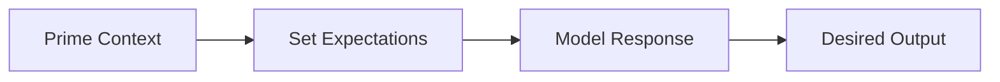
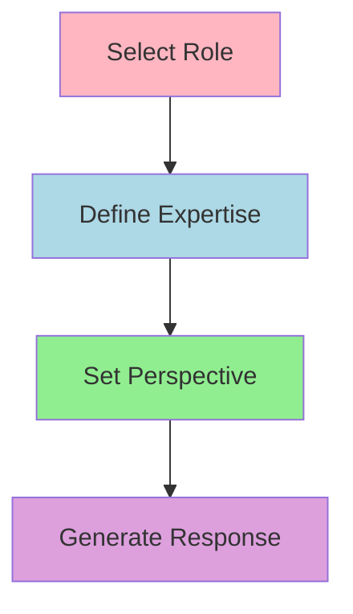

# Prompt Engineering for LLM

Prompt engineering is the art and science of crafting effective inputs (prompts) for Large Language Models (LLMs) to generate desired outputs. It's a crucial skill for maximizing the potential of AI language models.

### 1. Performance Limitations 🚫

Let's understand that LLMs, while powerful, have several key limitations:

- Inconsistency in responses - may provide different answers to the same question
- Potential for hallucinations - can generate plausible but incorrect information
- Difficulty with complex mathematical calculations
- Challenges in maintaining long-term consistency in extended conversations

### 2. Context Length Impact 📏

The context window size significantly affects LLM performance:

- Longer context allows for more detailed and informed responses
- Limited context can lead to incomplete or inaccurate outputs
- Context window varies by model (e.g., GPT-3.5 vs GPT-4)

### 3. Response Length Considerations 📝

The length of LLM responses affects prompt engineering in several ways:

- Shorter responses tend to be more focused and precise
- Longer responses may include more detail but risk going off-topic
- Balance between completeness and conciseness is crucial

### 4. Prompt Design Impact ⚡

The way we design prompts directly influences LLM performance:

- Clear instructions lead to more accurate responses
- Structured prompts help maintain response consistency
- Specific formatting requests improve output organization

### 5. Prompt Engineering Principles 🎯

Key principles to remember when engineering prompts:

- Be specific and explicit in instructions
- Use examples when needed (few-shot learning)
- Break complex tasks into smaller steps
- Include context and constraints clearly

### 6. Role of Tokenization 🔤

Tokenization is fundamental to how LLMs process information:

- Words are broken down into tokens (smaller units)
- Token limits affect context window size
- Efficient tokenization can improve model performance

Just like learning a new language, mastering prompt engineering takes practice and patience. Keep experimenting with different approaches to find what works best for your specific needs.

# Prompting Best Practices ✨

Best practices are of very important matter in prompt engineering. This is the reason I’m putting it in starting instead in the end of page.

### 1. Clear and Specific Instructions 📝

Using clear and specific instructions helps the model understand exactly what you want. Here's how to achieve this:

- **Use Delimiters:** Separate different parts of your prompt using delimiters like ```, """, or ###

    ```jsx
    ### Instructions ###
    Analyze the following text for sentiment
    ### Input ###
    The product exceeded my expectations
    ### Output Format ###
    Provide sentiment (positive/negative/neutral) with confidence score
    ```

- **Specify Output Format:** Clearly state how you want the response structured
- **Break Down Complex Tasks:** Split complicated requests into smaller, manageable parts
    
    Example: “*Use separate prompts for each state of growth.*”
    

### 2. Prompt Priming 🎨

Prompt priming sets the context and tone for the model's responses.



Example of primed prompt:

```jsx
Context: You are an expert data scientist explaining concepts to beginners
Tone: Friendly and educational
Task: Explain what is machine learning
Audience: High school students
```

### 3. Condition Checking ✅

Guide the model to verify specific conditions before providing responses:

```jsx
Before answering, please check:
1. Is the question within ethical boundaries?
2. Are all required inputs provided?
3. Is the request clear and specific?
If any check fails, ask for clarification.
```

### 4. Guiding Questions 🤔

Train the model to ask relevant follow-up questions:

```jsx
Task: Help user with workout plan
Required Information:
1. Ask about fitness goals
2. Inquire about current fitness level
3. Check for any health conditions
4. Ask about time availability
5. Verify access to equipment
```

### 5. Role-Based Prompting 👥

Enhance responses by assigning specific roles to the model:



Example:

```jsx
Role: Senior Software Architect
Expertise: 15 years in system design
Task: Review this architecture proposal
Perspective: Focus on scalability and security
```

### 6. Open-Ended Prompting 🌟

Encourage creative and diverse responses through open-ended prompts:

- **Instead of:** "List 5 ways to improve productivity"
- **Use:** "Explore various approaches to enhance productivity, considering different work styles and environments"

Example of open-ended prompt structure:

```jsx
Topic: Future of Transportation
Approach: Consider multiple perspectives
Areas to explore:
- Technological innovations
- Environmental impact
- Social implications
- Economic factors
Format: Free-form discussion with supporting examples
```

# Common Use Cases 🎯

## Text Analysis and Inference

Prompts can be designed to extract meaningful insights from text data:

- **Sentiment Analysis:** Determine the emotional tone of customer reviews, social media posts, or feedback
- **Topic Extraction:** Identify main themes and subjects from articles or documents
- **Entity Recognition:** Extract key information like names, dates, and locations from text

## Text Summarization

Creating effective prompts for condensing large texts while maintaining key information:

```jsx
Task: Summarize the following text
Length: Maximum 3 key points
Focus: Main arguments and conclusions
Style: Bullet points
Additional requirement: Maintain critical details
```

## Text Expansion and Generation

Developing prompts for expanding brief inputs into detailed content:

- **Email Generation:** Convert bullet points into professional emails
- **Content Elaboration:** Expand brief notes into detailed articles or reports
- **Description Enhancement:** Transform basic product descriptions into compelling marketing copy

```jsx
Task: Expand this email outline
Context: Following up on client meeting
Key points to include:
- Thank for their time
- Summarize discussion points
- Propose next steps
Tone: Professional and friendly
Length: 2-3 paragraphs
```

# Commercial Use Cases 🚀

## Social Media Content Generation

LLMs can be used to create engaging social media content through carefully crafted prompts:

```jsx
Role: Social Media Manager
Task: Create engaging posts for {product}
Requirements:
- Platform-specific format (Twitter/Instagram/LinkedIn)
- Include relevant hashtags
- Maintain brand voice
- Include call-to-action
Tone: {casual/professional/friendly}
```

Example prompts:

“*Create engaging social media posts for the eco-friendly water bottle, tailoring the content’s tone to specific social media.*”

## Content Marketing Automation

Streamline content creation processes using prompt engineering:

- **Blog Post Generation:** Create structured outlines and expand them into full articles
- **Newsletter Content:** Generate personalized email content for different audience segments
- **Product Descriptions:** Create compelling product descriptions with specific features and benefits

## Customer Service Enhancement

Implement prompt engineering for customer support:

```jsx
Context: Customer Support Representative
Input: Customer query about {topic}
Requirements:
- Professional and empathetic tone
- Include relevant policy information
- Provide step-by-step solutions
- Suggest additional helpful resources
```

## E-commerce Applications

Leverage prompt engineering for:

- **Product Recommendations:** Generate personalized product suggestions based on user preferences
- **Review Analysis:** Summarize and categorize customer feedback
- **SEO Optimization:** Create search-engine-friendly product descriptions and meta tags

# 📝 Basic Prompt Formulation

Basic prompt formulation is the foundation of effective communication with LLMs. Here's a comprehensive guide to creating effective prompts:

### 1. Iterative Testing and Refinement

- **Start Simple:** Begin with basic prompts and gradually add complexity
- **Test Variables:** Experiment with different phrasings and structures
- **Document Results:** Keep track of what works and what doesn't
- **Refine Based on Feedback:** Continuously improve prompts based on outputs

### 2. General Prompt Framework

```jsx
Structure:
1. Context: [Background information]
2. Instruction: [Specific task or request]
3. Format: [Desired output format]
4. Constraints: [Any limitations or requirements]
5. Examples: [Sample inputs/outputs if needed]
```

### 3. Purpose and Intent

The primary purposes of prompt engineering include:

- **Task Optimization:** Improving the accuracy and relevance of AI responses
- **Consistency Control:** Ensuring reliable and predictable outputs
- **User Experience:** Enhancing interaction between users and AI systems

### 4. Language Style and Audience Adaptation

Tailoring prompts to your audience:

```jsx
Technical Audience:
- Use precise terminology
- Include technical specifications
- Focus on accuracy

General Audience:
- Use simple, clear language
- Provide examples
- Avoid jargon
```

### 5. Brand Voice Integration

- **Voice Guidelines:** Incorporate specific brand terminology and tone
- **Personality Traits:** Reflect brand characteristics in prompt structure
- **Consistency:** Maintain uniform brand representation across interactions

### 6. Contextual Information Integration

Effective ways to incorporate context:

- **Historical Context:** Include relevant background information
- **Current State:** Provide current situation or circumstances
- **Future Goals:** Specify desired outcomes or objectives

### 7. Continuity in Conversations

```jsx
Previous Input: [Reference to past interaction]
Current Context: [Current situation]
New Request: [Additional information needed]
Memory Elements: [Key points to maintain continuity]
```

### 8. User Intent Definition

Key aspects of defining user intents:

- **Goal Identification:** Clearly state what the user wants to achieve
- **Success Criteria:** Define what constitutes a successful interaction
- **Edge Cases:** Anticipate and handle potential variations in user requests

💡 **Pro Tip:** Always start with a clear understanding of your user's needs and gradually build complexity into your prompts based on actual usage patterns and feedback.

Remember that prompt formulation is an iterative process that requires constant refinement based on real-world application and user feedback.

# 🔄 Advanced Prompting Techniques

## Chain-of-Thought Prompting ⛓️

Guide the model through logical steps.

Chain-of-thought prompting is particularly useful for:

- Mathematical reasoning and problem-solving
- Complex decision-making processes
- Step-by-step explanations
- Debugging and error analysis

Example:

```jsx
Task: Explain why 17 x 24 = 408
Chain of Thought:
1. Let's break this down into steps
2. First, 17 x 20 = 340 (17 x 2 x 10)
3. Then, 17 x 4 = 68 (17 x 2 x 2)
4. Finally, 340 + 68 = 408
Therefore, 17 x 24 = 408
```

This example shows how the model breaks down a complex multiplication problem into simpler steps, making the reasoning process explicit and easier to follow. 

Example prompt:

“*For each insight in the dataset, provide a step-by-step analysis of how you reached that conclusion and it’s implications.*”

## Zero-Shot Prompting 🎯

Zero-shot prompting is a technique where the model performs tasks without any examples or prior training specific to that task. It relies on the model's inherent knowledge to understand and execute the request.

Key characteristics of zero-shot prompting:

- Direct instructions without examples
- Relies on clear, explicit task descriptions
- Useful for straightforward tasks

Example:

```jsx
Task: Classify the following sentence into positive, negative, or neutral
Input: "The weather today is absolutely gorgeous!"
Instructions: Provide only the classification label as response
```

While zero-shot prompting is simpler to implement, it may be less effective for complex or nuanced tasks compared to few-shot or chain-of-thought prompting techniques.

## Active-Prompt Technique

Active prompting is a technique where you actively guide the model's behavior by including specific instructions about how to approach and respond to the task. This method helps maintain control over the AI's response pattern and output format.

Key elements of active prompting:

- **Response Format Control:** Explicitly specify how the answer should be structured
- **Behavioral Guidelines:** Set clear rules for how the AI should process and respond
- **Output Constraints:** Define specific limitations or requirements for the response

Example of active prompting:

```jsx
Instructions:
1. Approach this question step-by-step
2. First explain the basic concept
3. Then provide a practical example
4. Finally, summarize key takeaways
5. Keep explanations concise
6. Use simple language
7. Include no more than three points per section

Topic: Explain photosynthesis
```

Active prompting is particularly effective when:

- You need highly structured responses
- Consistency across multiple queries is important
- Specific output formats or styles are required

💡 **Pro Tip**: Combine active prompting with other techniques like role-based or chain-of-thought prompting for even more precise control over AI outputs.

## Automatic Prompt Engineering 🤖

Automatic prompt engineering involves creating adaptable prompts that can automatically adjust based on context, user input, and changing requirements. Here's how to implement automatic prompt engineering for dynamic situations:

### 1. Template-Based Generation

- **Variable Placeholders:** Create prompt templates with dynamic variables that can be filled programmatically
- **Conditional Logic:** Include if-then statements to handle different scenarios
- **Context Injection:** Automatically insert relevant context based on user history or system state

```jsx
Template Example:
{
    "base_prompt": "As a {role}, analyze {data_type} and provide {output_format}",
    "context_vars": {
        "role": ["expert", "analyst", "advisor"],
        "data_type": ["market trends", "user behavior", "performance metrics"],
        "output_format": ["summary", "detailed report", "recommendations"]
    }
}
```

### 2. Feedback Loop Implementation

1. Generate Candidate prompts based on examples.
2. Executing and evaluating these prompts with the target model.
3. Then selecting effective prompts based on evaluation scores.

## Self-Consistency Techniques 👽

Self-consistency in AI responses refers to **ensuring that the model's outputs remain logically coherent and consistent** across multiple generations. 

Here are key techniques to check if the model is self-consistent:

### 1. Rephrasing Prompts

Rephrasing prompts involves reformulating the same question in different ways to validate responses and ensure consistency. This technique helps:

- Verify the accuracy of responses across different phrasings
- Identify potential biases in specific formulations
- Enhance the robustness of the output

Example approaches include changing:

- Word order
- Sentence structure
- Vocabulary while maintaining meaning

### 2. Using Follow-up Prompts

Follow-up prompts are sequential questions that help:

- Validate initial responses
- Drill down into specific details
- Cross-reference information for consistency

Common follow-up techniques include:

- Asking for explanations of previous responses
- Requesting examples or counterexamples
- Challenging assumptions in the initial response

### 3. Implementing Checksums or Markers

Checksums and markers are validation techniques that:

- Ensure completion of all required components
- Verify the integrity of the response
- Track the flow of information

Implementation methods include:

- Adding numerical markers to track sequence
- Using specific formatting patterns
- Implementing verification steps at key points

## Generated Knowledge Prompting

Generated knowledge prompting is a technique where you explicitly ask the AI to generate specific information or knowledge before using it to answer a question. This helps in breaking down complex queries and ensuring comprehensive responses.

Example of generated knowledge prompting:

```jsx
Step 1: Generate Knowledge
"Before answering the main question, please generate:
1. List three key principles of machine learning
2. Define supervised vs unsupervised learning
3. Explain the role of datasets in ML

Step 2: Apply Knowledge
Using the information generated above, explain how machine learning can be applied to improve customer service automation."
```

Key benefits of generated knowledge prompting:

- **Enhanced Accuracy:** By first generating relevant knowledge, the model has a better foundation for answering questions
- **Structured Thinking:** Helps break down complex topics into manageable components
- **Transparency:** Makes the reasoning process more visible and verifiable

💡 **Pro Tip**: When using generated knowledge prompting, be specific about what type of information you want the model to generate and how it should be used in the final response.

## Few-Shot Learning

Few-shot learning is a technique where you provide the model with a few examples of the task you want it to perform before asking it to complete a similar task. This helps establish the pattern and format you're looking for.

Example of few-shot learning:

```jsx
Task: Classify customer feedback as positive, negative, or neutral

Example 1:
Input: "The service was excellent and the staff was very friendly!"
Output: Positive

Example 2:
Input: "The product arrived damaged and customer support was unhelpful."
Output: Negative

Example 3:
Input: "The delivery was on time as expected."
Output: Neutral

Now classify this:
Input: "The quality exceeded my expectations and I'll definitely buy again!"
```

In this example, providing three different classifications helps the model understand the pattern and criteria for categorizing feedback, leading to more accurate responses.

Few-shot learning is particularly effective when:

- You need consistent formatting or style in responses
- The task requires specific patterns or rules to follow
- You want to demonstrate the level of detail or complexity expected

## ReAct (Reasoning + Acting) Technique

ReAct is an advanced prompting technique that **combines reasoning and acting** to produce more reliable and refined responses. 😅 

When implementing ReAct, encourage the model to explain its thinking process before taking actions, making it easier to identify and correct potential issues in the reasoning chain.

It follows a systematic approach of thought, action, and observation:

1. **Reasoning (Thought):** The model explicitly states its reasoning process, using this identify the limitation of the AI response.
2. **Acting:** Takes specific actions based on the reasoning.
3. **Observation:** Analyzes the results and adjusts the approach if needed

Example implementation:

```jsx
Task: Find the best approach to summarize a technical article

Thought: I need to understand the articles complexity and target audience
Action: Analyze the technical depth and identify key concepts
Observation: Article contains specialized terminology and complex concepts

Thought: Need to make content accessible while maintaining accuracy
Action: Create a multi-level summary approach
Observation: This allows both technical and non-technical readers to benefit

Thought: Should include key takeaways for quick reference
Action: Extract main points and practical implications
Final Response: Structured summary with varying detail levels
```

Benefits of the ReAct technique:

- **Improved Accuracy:** Through systematic evaluation and refinement
- **Transparent Decision-Making:** Clear reasoning process visible to users
- **Adaptable Responses:** Can adjust based on intermediate observations
